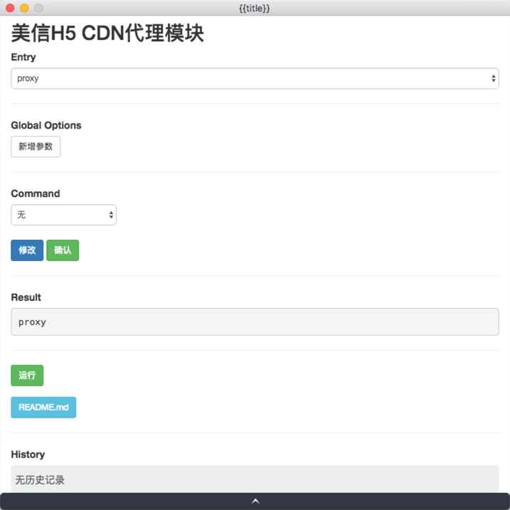
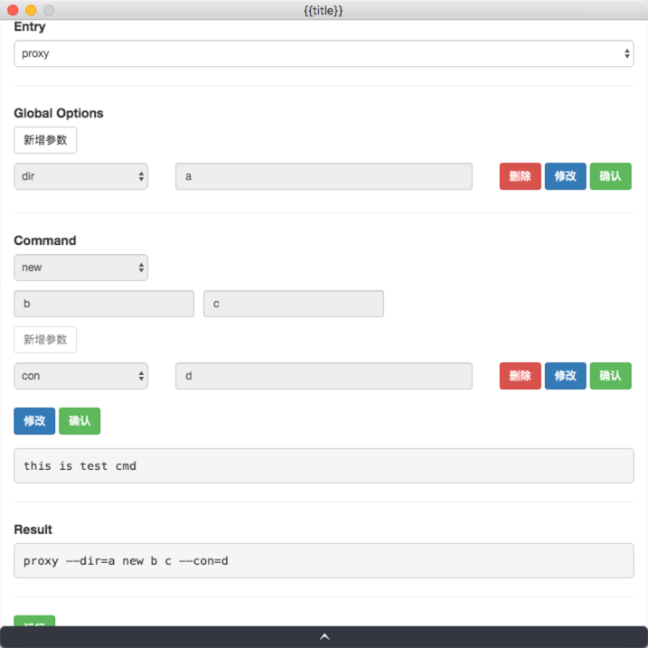
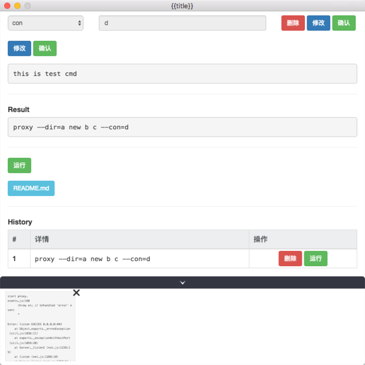
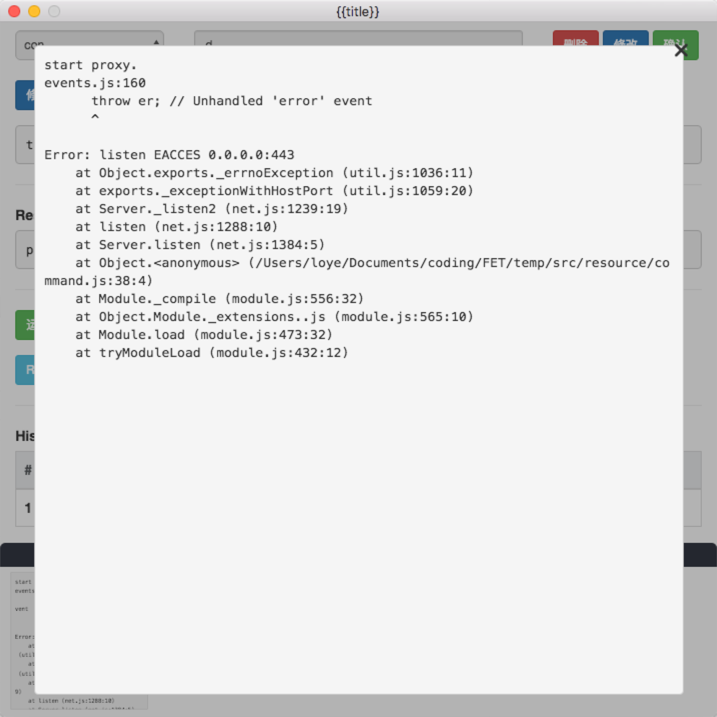

cmd2app - Convert you command line client to electron app.  
=================

## Install

```bash
(sudo) npm install cmd2app -g
```

## How to convert?

* Complete your command line client.

* Add some field to `package.json` to describe your command line client.

    All options as follow example. 

    ```js
    /* package.json */
    {
        "name": "cmd2app example",
        // ...
        "cmd2app" : {
            "repository": "https://github.com/gomeplusFED/meixin-h5-proxy",  // your repo address
            "title": "美信H5 CDN代理模块", // title your want to show
            "bin": ["proxy", "test"], // bin entrance
            "globalOptions": { // global options
                "dir": { // option detail
                    "desc": "the catalog to be proxyed" // option desc
                },
                "port": {
                    "desc": "http portal, default 80"
                },
                "ports": {
                    "desc": "https portal, default 443"
                },
                "foreign": {
                    "desc": "public dependencies path"
                },
                "path": {
                    "desc": "middle path,default /m/app/src"
                },
                "raw": {
                    "desc": "raw path"
                }
            },
            "command": { // command
                "new": { // key
                    "params": [{ //parmas
                        "desc": "repo address" // params desc
                    }, {
                        "desc": "local path"
                    }],
                    "options": { // command options
                        "con": {
                            "desc": "con desc"
                        },
                        "abc": {
                            "desc": "abc desc"
                        }
                    },
                    "desc": "this is test cmd" // command desc
                },
                "test": {
                    "params": [{
                        "desc": "test params"
                    }],
                    "options": {
                        "dir": "the catalog to be proxyed"
                    },
                    "desc": "# create a new app with an official repo"
                }
            }
        }
    }
    ```
    For example.  

    #### bin + global options

    `proxy --dir="/c" --path="/b" --foreign="/a" --port=8011 `

    `proxy -> bin`  
    `dir/path/foreign/port -> global options`  

    #### bin + global options + command + command options  

    `proxy --port=8001 new a b --con=123`  

    `proxy -> bin`  
    `port -> global option`  
    `new -> command`  
    `a -> command params 1`  
    `b -> command params 2`  
    `con -> command option`  

* Use `cmd2app` to build your app.

    ```shell
    (sudo) npm install cmd2app -g

    cmd2app new [author/repo] [path]

    cd [path] && npm install

    electron [path]/src/main/app.babel.js # you should global install electron
    ```

    ##### Note: 

    * Final file not a full app, it's just source code what can run by `electron`.

    * If you want run your app, you should install [electron](https://github.com/electron) environment, and use some package tools to package your app, like [electron-builder](https://github.com/electron-userland/electron-builder) / [electron-packager](https://github.com/electron-userland/electron-packager) and so on.

    * Also, you can wrap your app further to a plugin for [FET](https://github.com/gomeplusFED/FET). FET is a plugin plataform, you can easily wrap your app to a plugin. [More in here](./doc/fet.md)

## Some images .

* #### Main  

    

* #### With all options

    

* #### Run

    

* #### Run result

    

